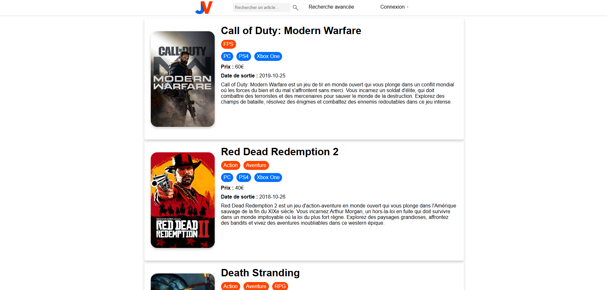

# portail-critique-jeux

Site de critiques de jeux vidéo permettant aux utilisateurs de noter et commenter des jeux.

## Description

Ce projet est un portail de critiques de jeux vidéo développé dans le cadre du module BDD et IHM au semestre 4. Il permet aux utilisateurs de noter et commenter divers jeux vidéo.

## Fonctionnalités

- Affichage des critiques de jeux vidéo
- Recherche de jeux par nom ou genre
- Notation et commentaire des jeux par les utilisateurs

## Technologies Utilisées

- PHP
- SQL
- HTML
- CSS
